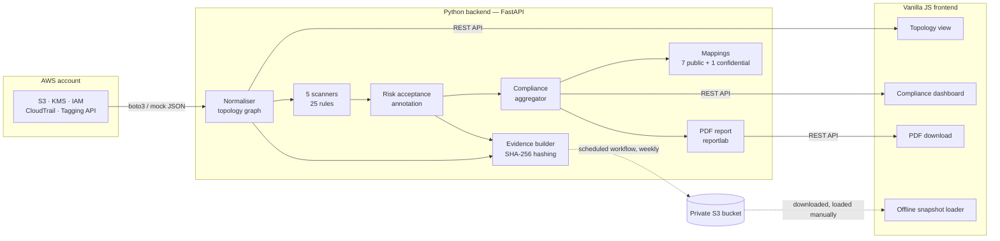

# Cloud Resilience Visualizer


🔗 **[Live Demo](https://josephademola.github.io/cloud-resilience-visualizer)** · **[API Docs](https://cloud-resilience-visualizer.onrender.com/docs)**

A Cloud Security Posture Management (CSPM) tool that scans AWS environments across S3, KMS, IAM, and account-level configuration, maps every finding to seven published compliance frameworks, and produces audit-grade evidence records and PDF reports — with a data-driven risk-acceptance mechanism so a consciously accepted risk never has to be tracked in a separate spreadsheet.

Built as a portfolio project targeting UK GRC Engineer and Cloud Security roles. Demonstrates compliance automation, infrastructure scanning, and audit-trail production — the core competencies of GRC engineering.

---

## What it does

Points at an AWS account (or a realistic mock environment), discovers the infrastructure topology, runs **25 misconfiguration rules across 5 scanners** (S3, KMS, IAM, account-level, and resource tagging), and produces:

- An interactive **topology visualisation** showing every resource and its relationships
- A **compliance dashboard** grouping findings by framework requirement across **seven published frameworks** (NIS2, NCSC CAF, MITRE ATT&CK, Cyber Essentials, ISO 27001, DORA, CIS AWS Foundations Benchmark) — plus an optional eighth, engagement-specific control catalogue that activates only when a scan is explicitly scoped to that project's tag, and is never committed to this repo
- A **risk-acceptance / suppression mechanism**: a consciously accepted risk is never deleted or hidden from the findings list or evidence record, only annotated — it just stops counting as an open compliance gap
- A **PDF audit report** suitable for handing to an auditor
- A **signed evidence record** with SHA-256 integrity hashing for chain-of-custody proof
- A **tag-scoped scan mode** (`?project_tag=Project=X`) so the same tool can audit one tagged project inside a larger account without seeing anything outside its scope
- An **offline report viewer** — a previously-generated scan snapshot (JSON, downloaded from wherever it was archived) can be loaded straight into the same dashboard UI, entirely client-side, no backend or AWS credentials involved
- A **REST API** with API key authentication for programmatic access

When first run against a real AWS account, the tool discovered a real customer-managed KMS key with rotation disabled and pending deletion, and a real S3 bucket with an accidental public ACL grant left over from an earlier project — exactly what a real CSPM tool is for.

A **scheduled GitHub Actions workflow** (OIDC-authenticated, no long-lived AWS credentials) runs this same scan weekly against a tagged AWS project and delivers the evidence record straight to a private S3 bucket — never to a public artifact.

---

## Architecture



Key design decisions:

**Content separated from code.** Finding titles, descriptions, remediation guidance, and framework references all live in JSON files (`finding_content.json`, `mappings/*.json`). Security engineers can update content without touching Python. The scanner contains only detection logic.

**Fail-closed on protection signals, fail-open on detection signals.** If a bucket's Public Access Block state is missing from the API response, the scanner flags it as disabled — you cannot confirm protection is present, so you assume it is not. A signal that only ever *detects* a bad state (e.g. an ACL grant) is the opposite: missing data means nothing was detected, not that something bad is assumed. Every new rule states explicitly which of the two it is.

**Deterministic output.** Scanning the same environment twice always produces identical findings in identical order. This matters for compliance work — non-deterministic findings would make audit comparisons meaningless.

**Mock shape is the live contract.** The `mock_aws.json` file is shaped exactly like real boto3 API responses. Switching between mock and live data requires changing one environment variable, not the normaliser or scanner code.

**Auditability over convenience.** A risk that's been consciously accepted is never silently dropped from the record — it's excluded from the compliance dashboard's failing-requirement counts (since it's no longer an open gap), but it stays fully visible in `/api/findings`, the evidence record, and the PDF report, tagged with who accepted it, why, and until when.

**Honest framework mappings, not padded ones.** Every mapping has documented rationale in `_meta.audit_notes`. Where a framework genuinely doesn't cover something CRV checks for — the CIS AWS Foundations Benchmark, for instance, has no requirement at all for S3 encryption-at-rest, versioning, or lifecycle management — that gap is left unmapped and explained, not force-fitted onto an unrelated control just to make every framework's coverage look complete.

---

## Framework coverage

| Framework | What it is | How it is mapped |
|---|---|---|
| EU NIS2 Directive (2022/2555) | EU regulation for essential and important entities | Article 21(2) sub-paragraphs |
| NCSC Cyber Assessment Framework v4.0 | UK government outcomes-based framework for regulated infrastructure | Objective A/B/C outcomes |
| MITRE ATT&CK Enterprise (Cloud IaaS) | Attacker technique catalogue | Cloud IaaS sub-matrix techniques, across Initial Access, Persistence, Privilege Escalation, Collection, and Defense Evasion tactics |
| UK Cyber Essentials | UK government baseline certification | Five control themes |
| ISO/IEC 27001:2022 Annex A | International information security management standard | Annex A controls |
| EU DORA (2022/2554) | EU digital operational resilience regulation for financial entities | Numbered articles |
| CIS AWS Foundations Benchmark v5.0.0 | Vendor-neutral foundational AWS security baseline | Numbered requirements — mapped for 13 of 25 finding types; the other 12 are documented gaps in the benchmark's own scope, not this project's mapping |

An eighth, engagement-specific control-catalogue mapping exists in the codebase's design but is gitignored and only ever loaded for a scan explicitly scoped to that project's AWS resource tag — it is never present in this repo or its history.

Every mapping has documented rationale in `_meta.audit_notes` within the mapping files. Where a mapping is interpretive, was corrected from an earlier draft, or is deliberately left absent, the reasoning is recorded inline.

---

## Scanner rules

25 rules across 5 scanners, each with a documented severity rationale and fail-open/fail-closed semantics stated explicitly in the scanner's own docstring.

| Scanner | Rules | Highlights |
|---|---|---|
| `s3_scanner.py` | 10 | Public ACL exposure (both AllUsers and the easy-to-miss AuthenticatedUsers grantee), Public Access Block, encryption presence *and* whether it uses a dedicated KMS key, versioning, logging, lifecycle configuration *and* whether a configured rule is actually enabled, TLS enforcement |
| `kms_scanner.py` | 4 | Key rotation, pending deletion, missing alias, overly broad key policy (unconditioned wildcard principal) |
| `iam_scanner.py` | 8 | Root access keys, root MFA, password policy strength, access key age, console login on a service identity, multiple simultaneously active keys, a directly-attached AdministratorAccess policy, and a custom policy granting an unconditioned `Action:*`/`Resource:*` |
| `account_scanner.py` | 2 | CloudTrail disabled, account-wide S3 Public Access Block disabled |
| `tagging_scanner.py` | 1 | Resource missing any tag at all (only meaningful on an unscoped scan — see `docs/design_decisions.md` #12) |

---

## Quick start

### Prerequisites

- Python 3.11+
- Node not required (vanilla JS, no build step)
- AWS CLI configured with a profile (for live scanning)

### Run against the mock

```bash
cd backend
python -m venv .venv && source .venv/bin/activate
pip install -r requirements.txt
uvicorn app.api.main:app --reload
```

Open `frontend/index.html` with VS Code Live Server. Topology and compliance views load automatically.

### Run against a real AWS account

```bash
export USE_LIVE_AWS=true
export API_KEY=your-key-here
uvicorn app.api.main:app --reload
```

PowerShell:

```powershell
$env:USE_LIVE_AWS = "true"
$env:API_KEY = "your-key-here"
uvicorn app.api.main:app --reload
```

The tool discovers all resources in the configured account and region automatically. Add `?project_tag=Project=<value>` to any endpoint to scope the scan to only resources carrying that tag (account-wide findings like CloudTrail and root MFA still always apply, since they aren't any one resource's to scope away).

### API endpoints

All endpoints except `/api/health` require an `X-API-Key` header.

| Endpoint | Returns |
|---|---|
| `GET /api/health` | Server liveness (no auth required) |
| `GET /api/topology` | Normalised resource graph |
| `GET /api/findings` | Scanner findings with framework references and risk-acceptance status |
| `GET /api/compliance` | Findings grouped by framework requirement, excluding risk-accepted findings from the failing counts |
| `GET /api/report` | PDF audit report (download) |
| `GET /api/evidence` | SHA-256 signed audit evidence record |

Interactive API docs available at `http://localhost:8000/docs` when the server is running.

---

## Risk acceptance

Every finding is present-or-absent by default, but a compliance officer sometimes needs to consciously accept a known risk — a compensating control is in place, remediation is scheduled but not yet done, the resource is being decommissioned. Dropping the finding from the scanner isn't the right answer: it destroys the audit trail of a decision that was actually made.

Instead, `backend/app/risk_acceptance.py` reads an optional, gitignored `risk_acceptances.json` (real people's names and business justifications belong in it, so it's never committed, same treatment as the engagement-specific framework mapping above) and annotates any matching finding with who accepted it, why, and until when. The finding stays fully visible everywhere — `/api/findings`, the evidence record, the PDF appendix — just marked. Only the compliance dashboard's "still failing" count treats it as resolved, and even there the exclusion is surfaced via a `risk_accepted_count`, never silent.

An acceptance can target one specific resource or use a `"*"` wildcard to cover a finding type account-wide, and an optional `expires` date lapses it back to active automatically if nobody renews it.

---

## Test infrastructure

474 tests across 23 test files. Run with:

```bash
cd backend && python -m pytest -v
```

| File | What it tests |
|---|---|
| `test_aws_normalizer_helpers.py` | Tag extraction and flag-parsing helpers, one class per boolean/derived property |
| `test_aws_normalizer_resources.py` | Per-resource normaliser functions (S3, KMS, IAM users, account) |
| `test_aws_normalizer_integration.py` | End-to-end normaliser against mock data |
| `test_aws_normalizer_tagging.py` | Tag-based scoping and `RESOURCE_MISSING_TAGS` detection |
| `test_mapping_loader.py` | Framework mapping loader, including CIS's deliberate partial coverage |
| `test_content_loader.py` | Finding content loader |
| `test_s3_scanner.py`, `test_kms_scanner.py`, `test_iam_scanner.py`, `test_account_scanner.py`, `test_tagging_scanner.py` | Individual scanner rule functions |
| `test_*_scanner_integration.py` | Each scanner against the real generated topology file |
| `test_compliance.py` | Compliance aggregator, including risk-accepted exclusion |
| `test_evidence_builder.py` | Evidence record shape, hash determinism, risk-accepted count |
| `test_risk_acceptance.py` | Matching, wildcard, and expiry logic for accepted risks |
| `test_finding.py` | `Finding` model and its JSON serialisation |
| `test_api.py` | All FastAPI endpoints, authentication, tag scoping, and the confidential/risk-acceptance pipeline end-to-end |
| `test_aws_client.py` | AWS client with moto-mocked boto3 calls |

---

## Infrastructure as code

A Terraform configuration in `infrastructure/main.tf` provisions a reproducible test environment in AWS (`eu-west-2`):

- 1 VPC with public and private subnets
- 1 EC2 `t3.micro` instance
- 1 RDS `db.t3.micro` MySQL instance
- 3 security groups (web / app / db chain)
- 2 S3 buckets: one properly configured, one deliberately misconfigured for scanner demonstration

```bash
cd infrastructure
terraform init
terraform apply    # creates 18 resources
terraform destroy  # tears everything down when done
```

---

## Deployment

The tool is fully deployed and publicly accessible:

- **Frontend:** [josephademola.github.io/cloud-resilience-visualizer](https://josephademola.github.io/cloud-resilience-visualizer)
- **Backend API:** [cloud-resilience-visualizer.onrender.com](https://cloud-resilience-visualizer.onrender.com)
- **API docs:** [cloud-resilience-visualizer.onrender.com/docs](https://cloud-resilience-visualizer.onrender.com/docs)

Backend is containerised with Docker and deployed on Render. Frontend is served via GitHub Pages. CI/CD via GitHub Actions runs the full test suite on every push to main. A separate weekly workflow runs a real, OIDC-authenticated scan against a tagged AWS project and delivers the evidence record to a private S3 bucket — never to a GitHub Actions artifact, since this repo is public.

> **Note:** The free tier on Render spins down after 15 minutes of inactivity. First request after a cold start takes approximately 30 seconds. The `/api/health` endpoint can be used to wake the service before a demo.

## Planned extensions

- Azure support alongside existing AWS integration for multi-cloud coverage
- Additional scanner rules covering EC2 security groups, RDS encryption, and network exposure
- True point-in-time IAM privilege-creep diffing (comparing a user's permissions against a remembered past scan, not just their current state) — needs persistent scan history this stateless tool doesn't yet have
- A real risk-acceptance approval workflow on top of today's data-driven acceptance mechanism
- Terraform static analysis for shift-left compliance checking before deployment
