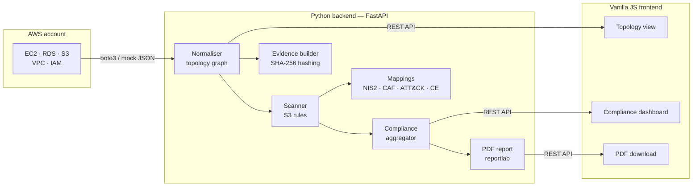

# Cloud Resilience Visualizer

A Cloud Security Posture Management (CSPM) tool that scans AWS environments for misconfigurations, maps findings to four compliance frameworks, and produces audit-grade evidence records and PDF reports.

Built as a portfolio project targeting UK GRC Engineer and Cloud Security roles. Demonstrates compliance automation, infrastructure scanning, and audit-trail production — the core competencies of GRC engineering.

---

## What it does

Points at an AWS account (or a realistic mock environment), discovers the infrastructure topology, scans S3 buckets for three classes of misconfiguration, and produces:

- An interactive **topology visualisation** showing every resource and its relationships
- A **compliance dashboard** grouping findings by framework requirement across four frameworks
- A **PDF audit report** suitable for handing to an auditor
- A **signed evidence record** with SHA-256 integrity hashing for chain-of-custody proof
- A **REST API** with API key authentication for programmatic access

When first run against a real AWS account, the tool discovered three misconfigured S3 buckets from earlier labs that had been forgotten — which is exactly what a real CSPM tool does for a customer.

---

## Architecture



Key design decisions:

**Content separated from code.** Finding titles, descriptions, remediation guidance, and framework references all live in JSON files (`finding_content.json`, `mappings/*.json`). Security engineers can update content without touching Python. The scanner contains only detection logic.

**Fail-closed on protection signals.** If a bucket's Public Access Block state is missing from the API response, the scanner flags it as disabled — you cannot confirm protection is present, so you assume it is not. Real CSPM tools (Prowler, ScoutSuite) follow the same principle.

**Deterministic output.** Scanning the same environment twice always produces identical findings in identical order. This matters for compliance work — non-deterministic findings would make audit comparisons meaningless.

**Mock shape is the live contract.** The `mock_aws.json` file is shaped exactly like real boto3 API responses. Switching between mock and live data requires changing one environment variable, not the normaliser or scanner code.

**Audit-grade evidence.** Every scan produces a structured record containing the input data hash, IAM identity used, tool version, findings summary, and an integrity hash covering the full record. Any post-hoc modification is detectable.

---

## Framework coverage

| Framework | What it is | How it is mapped |
|---|---|---|
| EU NIS2 Directive (2022/2555) | EU regulation for essential and important entities | Article 21(2) sub-paragraphs |
| NCSC Cyber Assessment Framework v4.0 | UK government outcomes-based framework for regulated infrastructure | Objective B outcomes (B2.a, B3.a, B3.c, B4.a) |
| MITRE ATT&CK Enterprise (Cloud IaaS) | Attacker technique catalogue | Cloud IaaS sub-matrix techniques (T1530, T1580) |
| UK Cyber Essentials | UK government baseline certification | Five control themes |

Every mapping has documented rationale in `_meta.audit_notes` within the mapping files. Where a mapping is interpretive or was corrected from an earlier draft, the reasoning is recorded inline.

---

## Scanner rules

Three S3 misconfiguration rules, each with a documented severity rationale:

| Rule | Severity | What it detects |
|---|---|---|
| `S3_PUBLIC_VIA_ACL` | Critical | AllUsers ACL grant — bucket readable by anyone on the internet |
| `S3_PUBLIC_ACCESS_BLOCK_DISABLED` | Medium | One or more PAB flags off — safety net has a hole |
| `S3_ENCRYPTION_DISABLED` | High | No server-side encryption — objects stored in plaintext |

---

## Quick start

### Prerequisites

- Python 3.11+
- Node not required (vanilla JS, no build step)
- AWS CLI configured with a profile (for live scanning)

### Run against the mock

```bash
cd backend
python -m venv .venv && source .venv/bin/activate
pip install -r requirements.txt
uvicorn app.api.main:app --reload
```

Open `frontend/index.html` with VS Code Live Server. Topology and compliance views load automatically.

### Run against a real AWS account

```bash
export USE_LIVE_AWS=true
export API_KEY=your-key-here
uvicorn app.api.main:app --reload
```

PowerShell:

```powershell
$env:USE_LIVE_AWS = "true"
$env:API_KEY = "your-key-here"
uvicorn app.api.main:app --reload
```

The tool discovers all resources in the configured account and region automatically.

### API endpoints

All endpoints except `/api/health` require an `X-API-Key` header.

| Endpoint | Returns |
|---|---|
| `GET /api/health` | Server liveness (no auth required) |
| `GET /api/topology` | Normalised resource graph |
| `GET /api/findings` | Scanner findings with framework references |
| `GET /api/compliance` | Findings grouped by framework requirement |
| `GET /api/report` | PDF audit report (download) |
| `GET /api/evidence` | SHA-256 signed audit evidence record |

Interactive API docs available at `http://localhost:8000/docs` when the server is running.

---

## Test infrastructure

158 tests across 11 test files. Run with:

```bash
cd backend && python -m pytest -v
```

| File | What it tests |
|---|---|
| `test_aws_normalizer_helpers.py` | Tag extraction and flag parsing helpers |
| `test_aws_normalizer_resources.py` | Per-resource normaliser functions |
| `test_aws_normalizer_integration.py` | End-to-end normaliser against mock data |
| `test_mapping_loader.py` | Framework mapping loader |
| `test_content_loader.py` | Finding content loader |
| `test_s3_scanner.py` | Individual scanner rule functions |
| `test_scanner_integration.py` | Scanner against real topology file |
| `test_compliance.py` | Compliance aggregator |
| `test_evidence_builder.py` | Evidence record and hash determinism |
| `test_api.py` | All FastAPI endpoints including authentication |
| `test_aws_client.py` | AWS client with moto-mocked boto3 calls |

---

## Infrastructure as code

A Terraform configuration in `infrastructure/main.tf` provisions a reproducible test environment in AWS (`eu-west-2`):

- 1 VPC with public and private subnets
- 1 EC2 `t3.micro` instance
- 1 RDS `db.t3.micro` MySQL instance
- 3 security groups (web / app / db chain)
- 2 S3 buckets: one properly configured, one deliberately misconfigured for scanner demonstration

```bash
cd infrastructure
terraform init
terraform apply    # creates 18 resources
terraform destroy  # tears everything down when done
```

---

## What comes next

Phase 8: Docker containerisation, GitHub Actions CI/CD pipeline, public deployment with HTTPS.

Planned extensions:
- Azure support alongside existing AWS integration for multi-cloud coverage
- Additional scanner rules covering EC2 security groups, RDS encryption, and IAM baseline checks
- Terraform static analysis for shift-left compliance checking before deployment