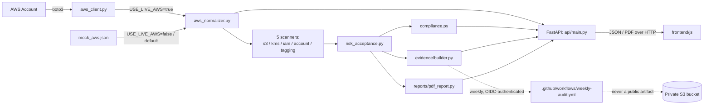

# Architecture

## System overview

Cloud Resilience Visualizer (CRV) is a Cloud Security Posture Management
(CSPM) tool. It reads AWS resource configuration (either live via boto3
or from a boto3-shaped mock file), normalises it into a flat topology
graph, scans that graph with 25 misconfiguration rules across 5
scanners (S3, KMS, IAM, account-level, and resource tagging), maps
each finding to seven published compliance frameworks (NIS2, NCSC CAF
v4.0, MITRE ATT&CK, Cyber Essentials, ISO 27001, DORA, CIS AWS
Foundations Benchmark) plus an optional gitignored engagement-specific
one, and exposes the result over a REST API consumed by a static
frontend. The same pipeline also produces a PDF audit report and a
SHA-256 signed evidence record for each scan, and supports a
data-driven risk-acceptance mechanism so a consciously accepted risk
stays fully visible in the record without counting as an open
compliance gap.

## Architecture diagram



## Three layers

### Data layer
`app/data/mock_aws.json` holds mock AWS data shaped exactly like real
boto3 API responses (`describe_vpcs`, `list_buckets`, `list_users`,
`get_key_policy`, etc., nested under `ec2` / `s3` / `kms` / `iam` /
`cloudtrail` / `resourcegroupstaggingapi` keys). `app/aws_client.py`
fetches the same shape from a real AWS account via boto3 when
`USE_LIVE_AWS=true`. Both paths hand an identical structure to the
normaliser, so the rest of the pipeline never knows which source it
came from.

### Backend layer
- `app/aws_normalizer.py` turns raw AWS data into a topology graph:
  `{metadata, nodes, security_groups}`, where each node is
  `{id, type, name, parent_id, properties}`. Node types: `s3_bucket`,
  `kms_key`, `iam_user`, `account` (a singleton for account-wide
  facts like root MFA and CloudTrail), plus the pre-existing VPC/EC2/
  RDS network nodes.
- Five scanner modules each walk the topology and run one detection
  function per rule against the node types they care about, returning
  `Finding` objects: `s3_scanner.py` (10 rules), `kms_scanner.py` (4),
  `iam_scanner.py` (8, split into account-wide and per-user rule
  groups), `account_scanner.py` (2), `tagging_scanner.py` (1).
  `app/scanners/content_loader.py` supplies the human-readable text
  for each finding from `app/scanners/finding_content.json`;
  `app/mappings/loader.py` supplies framework references from the
  mapping JSON files.
- `app/risk_acceptance.py` reads an optional, gitignored
  `risk_acceptances.json` and annotates any matching finding with
  who accepted it, why, and until when — findings are never deleted
  or hidden, only annotated. Applied once, centrally, in
  `app/api/main.py`'s `_scan_all()`, so every endpoint gets it for
  free.
- `app/compliance.py` reshapes the flat finding list into a
  framework-grouped view (NIS2 articles, NCSC CAF outcomes, MITRE
  ATT&CK techniques, Cyber Essentials themes, ISO 27001 controls,
  DORA articles, CIS AWS Foundations requirements) for the compliance
  dashboard, excluding risk-accepted findings from the failing counts.
- `app/reports/pdf_report.py` renders topology, findings, and
  compliance data into an A4 PDF via reportlab, including a
  risk-accepted marker on any annotated finding.
- `app/evidence/builder.py` produces a signed evidence record: a
  SHA-256 hash of the input topology, a findings summary (including a
  risk-accepted count), the IAM identity that ran the scan, a
  timestamp, and an integrity hash over the full record.
- `app/api/main.py` is the FastAPI app. It calls the library functions
  above and adds no business logic of its own; `app/api/auth.py`
  enforces the `X-API-Key` header on every route except `/api/health`.
- `backend/scripts/run_scheduled_audit.py` runs the same pipeline
  in-process (no HTTP layer) for the weekly GitHub Actions workflow,
  writing both the evidence record and a full topology+findings+
  compliance snapshot for the frontend's offline report viewer.

### Frontend layer
Static HTML/CSS/JS in `frontend/` (mirrored into `docs/` for GitHub
Pages). `frontend/js/topology.js` renders the topology graph, a
"Load report file" button for viewing an archived snapshot entirely
client-side, and holds the `API_BASE` / `API_KEY` constants used for
all fetches; `frontend/js/compliance.js` lazily fetches and renders
the compliance dashboard, including a note when any findings have
been risk-accepted.

## Data flow

1. Raw AWS data (live or mock) is loaded by `main.py`, optionally
   scoped to resources carrying a given tag (`project_tag`).
2. `normalize()` converts it into a topology graph.
3. `_scan_all()` runs all five scanners and combines their findings,
   then applies risk acceptances, then strips the confidential
   framework's references unless the scan is explicitly scoped to
   that project's tag.
4. From that finding list, three different views are built on demand:
   - `build_compliance_view()` → framework-grouped compliance data,
     risk-accepted findings excluded from the failing counts
   - `build_pdf_report()` → downloadable PDF
   - `build_evidence_record()` → SHA-256 signed audit evidence
5. Each view is returned directly by its FastAPI endpoint; nothing is
   cached or persisted between requests. A separate scheduled
   workflow runs the same pipeline weekly and delivers its output to
   a private S3 bucket instead of an HTTP response.

## Key files

| File | Responsibility |
|---|---|
| `app/api/main.py` | FastAPI app, all endpoints, scan orchestration (`_scan_all`) |
| `app/api/auth.py` | API key dependency |
| `app/aws_client.py` | Live boto3 calls |
| `app/aws_normalizer.py` | Raw AWS data to topology graph |
| `app/scanners/s3_scanner.py` | S3 misconfiguration detection rules (10) |
| `app/scanners/kms_scanner.py` | KMS key detection rules (4) |
| `app/scanners/iam_scanner.py` | Account-wide and per-user IAM detection rules (8) |
| `app/scanners/account_scanner.py` | Account-wide detection rules (2) |
| `app/scanners/tagging_scanner.py` | Resource-tagging detection rule (1) |
| `app/scanners/content_loader.py` | Loads finding text from JSON |
| `app/scanners/finding_content.json` | All finding titles/descriptions/remediation |
| `app/risk_acceptance.py` | Loads and applies consciously-accepted-risk annotations |
| `app/mappings/loader.py` | Loads and caches the framework mapping files |
| `app/mappings/*.json` | Finding-type to framework-requirement references |
| `app/compliance.py` | Groups findings by framework requirement |
| `app/reports/pdf_report.py` | PDF audit report generation |
| `app/evidence/builder.py` | SHA-256 signed evidence records |
| `app/models/finding.py` | `Finding` and `FrameworkReference` dataclasses |
| `scripts/run_scheduled_audit.py` | In-process runner for the weekly GitHub Actions audit |

## How to run locally

```powershell
cd backend
python -m venv .venv
.venv\Scripts\activate
pip install -r requirements.txt
uvicorn app.api.main:app --reload

# Run tests
python -m pytest -v
```

Open `frontend/index.html` with VS Code Live Server (CORS is
configured for ports 5500 and 5501 on both `127.0.0.1` and
`localhost`).

## Environment variables

| Variable | Purpose | Default |
|---|---|---|
| `USE_LIVE_AWS` | `true` fetches from a real AWS account via boto3; anything else (including unset) reads `mock_aws.json` | unset (mock) |
| `API_KEY` | Value required in the `X-API-Key` header on every endpoint except `/api/health` | `dev-only-insecure-key` |
| `CONFIDENTIAL_PROJECT_TAG` | Tag value that unlocks the gitignored engagement-specific framework mapping for a scoped scan | `ConfidentialClient` |
| `PORT` | Port uvicorn binds to inside the Docker container | `8000` |
