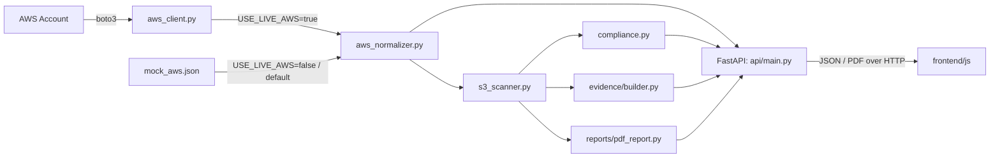

# Architecture

## System overview

Cloud Resilience Visualizer (CRV) is a Cloud Security Posture Management
(CSPM) tool. It reads AWS resource configuration (either live via boto3
or from a boto3-shaped mock file), normalises it into a flat topology
graph, scans that graph against a set of misconfiguration rules, maps
each finding to relevant compliance frameworks (NIS2, NCSC CAF 4.0,
MITRE ATT&CK, Cyber Essentials), and exposes the result over a REST API
consumed by a static frontend. The same pipeline also produces a PDF
audit report and a SHA-256 signed evidence record for each scan.

## Architecture diagram



## Three layers

### Data layer
`app/data/mock_aws.json` holds mock AWS data shaped exactly like real
boto3 API responses (`describe_vpcs`, `list_buckets`, etc., nested
under `ec2` / `s3` / `rds` keys). `app/aws_client.py` fetches the same
shape from a real AWS account via boto3 when `USE_LIVE_AWS=true`. Both
paths hand an identical structure to the normaliser, so the rest of the
pipeline never knows which source it came from.

### Backend layer
- `app/aws_normalizer.py` turns raw AWS data into a topology graph:
  `{metadata, nodes, security_groups}`, where each node is
  `{id, type, name, parent_id, properties}`.
- `app/scanners/s3_scanner.py` walks the topology and runs one
  detection function per rule against each S3 bucket node, returning
  `Finding` objects. `app/scanners/content_loader.py` supplies the
  human-readable text for each finding from
  `app/scanners/finding_content.json`; `app/mappings/loader.py`
  supplies framework references from the four mapping JSON files.
- `app/compliance.py` reshapes the flat finding list into a
  framework-grouped view (NIS2 articles, NCSC CAF outcomes, MITRE
  ATT&CK techniques, Cyber Essentials themes) for the compliance
  dashboard.
- `app/reports/pdf_report.py` renders topology, findings, and
  compliance data into an A4 PDF via reportlab.
- `app/evidence/builder.py` produces a signed evidence record: a
  SHA-256 hash of the input topology, a findings summary, the IAM
  identity that ran the scan, a timestamp, and an integrity hash over
  the full record.
- `app/api/main.py` is the FastAPI app. It calls the library functions
  above and adds no business logic of its own; `app/api/auth.py`
  enforces the `X-API-Key` header on every route except `/api/health`.

### Frontend layer
Static HTML/CSS/JS in `frontend/` (mirrored into `docs/` for GitHub
Pages). `frontend/js/topology.js` renders the topology graph and holds
the `API_BASE` / `API_KEY` constants used for all fetches;
`frontend/js/compliance.js` lazily fetches and renders the compliance
dashboard.

## Data flow

1. Raw AWS data (live or mock) is loaded by `main.py`.
2. `normalize()` converts it into a topology graph.
3. `scan_s3_buckets()` walks the topology and returns a list of
   `Finding` objects, each combining detection metadata, content from
   `finding_content.json`, and framework references from the mapping
   files.
4. From that finding list, three different views are built on demand:
   - `build_compliance_view()` → framework-grouped compliance data
   - `build_pdf_report()` → downloadable PDF
   - `build_evidence_record()` → SHA-256 signed audit evidence
5. Each view is returned directly by its FastAPI endpoint; nothing is
   cached or persisted between requests.

## Key files

| File | Responsibility |
|---|---|
| `app/api/main.py` | FastAPI app, all endpoints |
| `app/api/auth.py` | API key dependency |
| `app/aws_client.py` | Live boto3 calls |
| `app/aws_normalizer.py` | Raw AWS data to topology graph |
| `app/scanners/s3_scanner.py` | S3 misconfiguration detection rules |
| `app/scanners/content_loader.py` | Loads finding text from JSON |
| `app/scanners/finding_content.json` | All finding titles/descriptions/remediation |
| `app/mappings/loader.py` | Loads and caches the 4 framework mapping files |
| `app/mappings/*.json` | Finding-type to framework-requirement references |
| `app/compliance.py` | Groups findings by framework requirement |
| `app/reports/pdf_report.py` | PDF audit report generation |
| `app/evidence/builder.py` | SHA-256 signed evidence records |
| `app/models/finding.py` | `Finding` and `FrameworkReference` dataclasses |

## How to run locally

```powershell
cd backend
python -m venv .venv
.venv\Scripts\activate
pip install -r requirements.txt
uvicorn app.api.main:app --reload

# Run tests
python -m pytest -v
```

Open `frontend/index.html` with VS Code Live Server (CORS is
configured for ports 5500 and 5501 on both `127.0.0.1` and
`localhost`).

## Environment variables

| Variable | Purpose | Default |
|---|---|---|
| `USE_LIVE_AWS` | `true` fetches from a real AWS account via boto3; anything else (including unset) reads `mock_aws.json` | unset (mock) |
| `API_KEY` | Value required in the `X-API-Key` header on every endpoint except `/api/health` | `dev-only-insecure-key` |
| `PORT` | Port uvicorn binds to inside the Docker container | `8000` |
